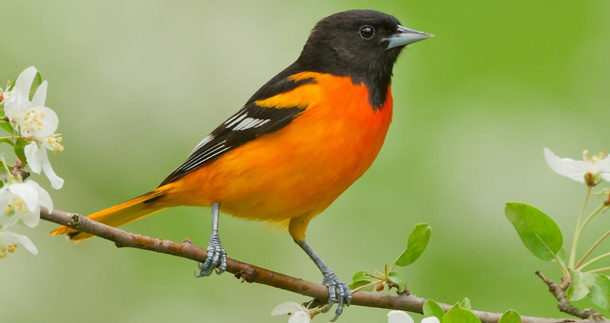

## Steganography Utility

### Description

Provides text-encoding and decoding capabilities for images. Due to the nature of the algorithm (direct modifications to image bits),
some image editors may be unable to view some encoded images. Note that the input image is not affected.

Both the length of the message and the message are
stored contiguously as LSBs starting from the third byte. The length is stored over four bytes and the actual message is stored after that.
This of course means that the image must be large enough to accommodate the offset and bytes to encode.
 
### Instructions

Generate an executable of stego.c.

For example, if you're using gcc:

```
// (Windows) In CMD shell
> g++ src/cli_driver.c src/stego.c -o stego.exe

// (Unixes / Mac OS X) In Bash shell
$ g++ src/stego.c src/cli_driver.c -o stego
$ chmod a+x stego
```

If you find it useful, add it to the PATH of your machine.

Application Programming Interface:
 
`stego encode --msg <your message to encode> --src <your source image> --dest <the destination location>`
 
`stego decode <your source image>`

You may find it useful to use pipes for encrypting and decrypting these messages.

### Example 

I want to encode the text "Rohan Talkad rocks!" into this image.



I will encode it via the following invocation:

```
$ stego encode --msg "Rohan Talkad rocks!" --src "examples/bird.jpg" --dest "examples/trgt.jpg"
```

I should find an image at `examples/trgt.jpg`. Ideally, it should appear the same as `examples/bird.jpg`.

To verify the output, I run the decode command and get the expected output.

```
$ stego decode "examples/trgt.jpg"
Rohan Talkad rocks!
```
